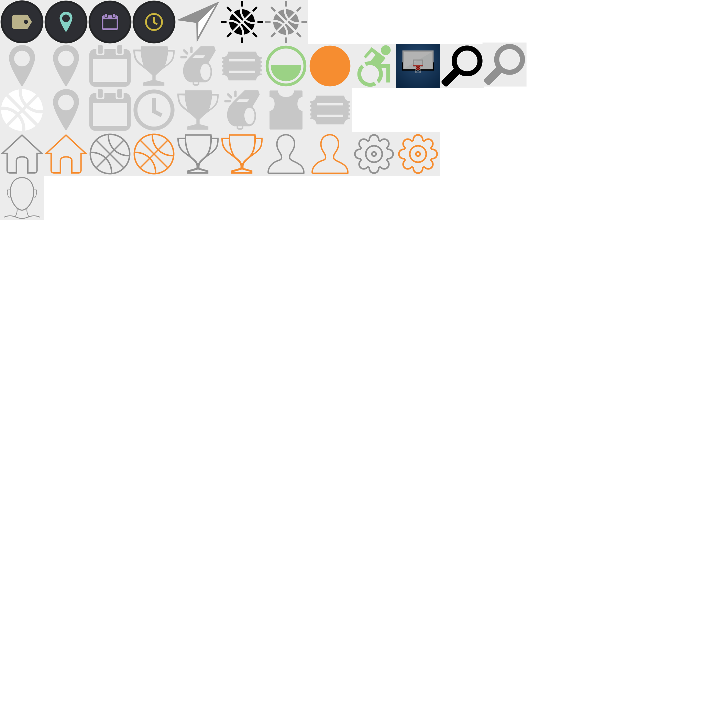

Use <a href="https://inkscape.org/en/download/windows/">Inkscape</a> to edit the .svg files.
<b>N.B:</b>The files inside here will change as the app images are added.

# Previews
## Icons
This contains all the designed icons so far. Any additional images will appear over here.

## Logo
This file contains the logo

